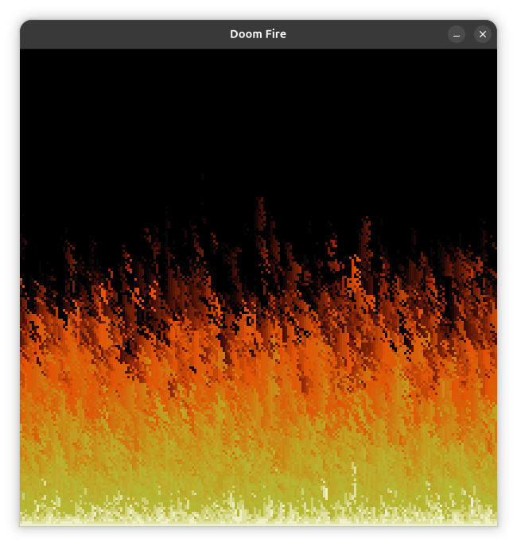

# Doom-fire effect_CPP-Raylib


This project recreates the Doom fire effect in C++ using the Raylib framework. It is based on project originally developed by Filipe Deschamps :)

# Requirements
 - g++
 - raylib 
 - Cmake 

# Compiling and running (linux)

```bash
# Clone the repository
git clone https://github.com/FrankSteps/Doom-fire-effect_CPP-Raylib
cd Doom-fire-effect_CPP-Raylib

# Compile
make

# Run
make run

```

**Note:** This program hasn't been tested on Windows or macOS yet. Additional information will be added later

# Author
| [<br><sub>@franksteps</sub>](https://github.com/franksteps) |
| :---: |

Check out the original repository:
https://github.com/franksteps/Doom-fire-effect_CPP-Raylib
